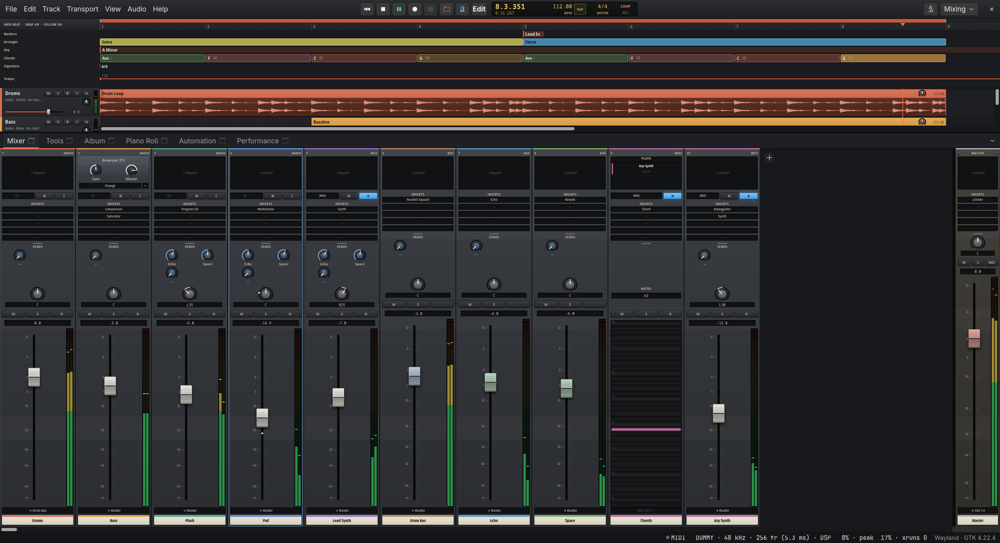
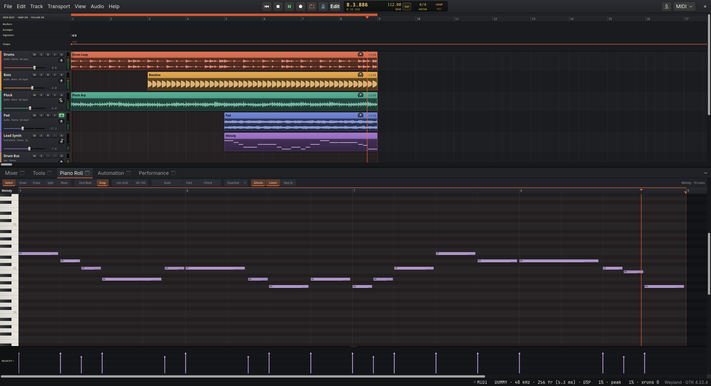
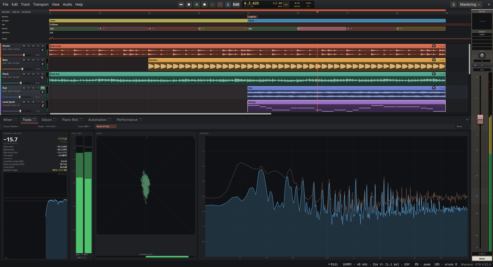
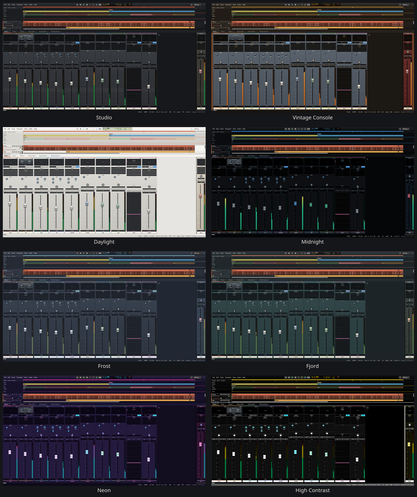

# FaderFrame

A multitrack recording, editing, mixing and mastering environment written in
Rust — Linux first, Wayland native, GTK 4 native; Windows and macOS builds
come from the same code.

FaderFrame aims to be a professional DAW: graph-based routing with buses,
aux sends and sidechains, hard-realtime multicore audio processing with
automatic plugin delay compensation, MIDI and virtual instruments,
automation, CLAP/VST3 hosting, an analogue-console-style mixer, mastering
meters and dockable, detachable editors.

> **Status: in active development.** Most of a working DAW is there; see
> [docs/ARCHITECTURE.md](docs/ARCHITECTURE.md#status-and-roadmap) for what
> comes next.

## Screenshots

The demo session playing — Mixing workspace:



The MIDI workspace with the piano roll editing the lead synth's melody:



The Mastering workspace with the Tools view (EBU R128 loudness, levels,
phase and spectrum):



Seven skins, switched live (View → Theme or Preferences → General → Theme):
Studio, Vintage Console (walnut cheeks, enamel panels, skirted knobs,
plasma bar-graph meters), Daylight (light), Midnight, Frost, Neon and High
Contrast:



## What works today

* GTK 4 application, native on Wayland, HiDPI/fractional scaling via GTK.
* Arranger (virtualised): tracks, audio clips with waveforms, MIDI clips,
  move/split/delete, snapping, zoom down to single samples, loop range,
  playhead, console-style track headers with mute/solo/arm/monitor, volume,
  pan and meters. Clicking a clip selects it and moves the playhead to the
  (snapped) click; Shift- or Ctrl-click selects more clips, and moves,
  trims, fades and gain changes apply to every selected clip.
* Global lanes under the ruler (click a lane's title to show or hide
  lanes): **markers** (double-click to add, drag to move, double-click to
  rename, click to jump there), the **arranger** lane for song sections
  (drag to create Intro, Verse, Chorus …; resize, rename, recolour, loop or
  select a section), **time signature** changes and the **tempo** map (drag
  points up and down or sideways, type values, steps or ramps).
* Song arrangement with sections: drag a section to move it *with its
  content* — clips (split at its edges), automation, tempo and time
  signature changes, markers — and the song closes up and makes room
  around it; Ctrl-drag inserts a copy, Shift-drag moves only the section.
  The section menu duplicates a section, moves it earlier or later, or
  deletes it with its content. Each is one undo step.
* Track colours: click a track's colour stripe (arranger) or colour bar
  (mixer) for a colour chooser, or pick from the palette in the track menu.
* Pro-style editing, with an edit toolbar under the transport (Edit button
  or Ctrl+E; it wraps into as many rows as the window needs): edit modes
  Shuffle, Slip, Spot and Grid (absolute or relative); the Smart tool
  (upper half selects a range, lower half grabs, edges trim, top corners
  fade) plus Zoom, Trim and Time-Stretch Trim, Selector, Grabber and
  Separation Grabber, Scrubber and Pencil; grids from a bar down to 1/256
  with triplet and dotted values; nudge values; Tab to clip boundaries or
  transients; Link Timeline and Edit Selection; Insertion Follows Playback;
  selection Start/End/Length counters in bars, time or samples; zoom
  buttons; a Follow button for scrolling along while playing. Range edits:
  separate, trim to selection, clear (Shuffle closes the gap),
  copy/cut/paste, duplicate, repeat, insert silence. The Scrubber plays the
  audio under the pointer while you drag; zoomed in to single samples, the
  Pencil redraws the waveform (click repair, on a copy — undo brings the
  original back).
* Clip gain: a gain knob in every audio clip's name strip (drag or turn
  the wheel; double-click resets, Alt-click types a value; Ctrl+Shift+↑/↓) and fades with five shapes (Linear, Equal Power,
  S-Curve, Fast, Slow) and a curve you bend by dragging its handle;
  right-click a fade to pick its shape.
* Transient detection (spectral flux, adjustable sensitivity, cached) and
  elastic audio: Warp view shows transients and warp markers — double-click
  adds a marker, dragging a transient moves just that hit (its neighbours
  stay pinned), dragging inside a selection warps only that range,
  Ctrl-drag telescopes; Separate at Transients and time-compression trims.
  Quantize (Q) and Humanize work on the selected clips, audio by its
  transients and MIDI by its notes alike: quantize strength and swing,
  note ends, humanize timing (ms) and velocity — set in the edit
  toolbar's Quantize menu or the piano roll's quantize settings. Warped clips play pitch-preserving
  (Polyphonic or Rhythmic, via Signalsmith Stretch) or as Varispeed.
* Transport: tap tempo (the TAP pad in the display), editable time
  signature (click it; right-click for common meters and meter changes),
  metronome button (K).
* Analogue-console mixer: inserts, sends (pre-FX / pre / post), pan, M/S/R,
  faders with a console fader law, segmented peak meters, routing menus,
  any number of sends per channel (rows grow, ◂ ▸ pages through banks),
  scribble strips, pinned master section; click a pan or level readout to
  type a value. The inserts section shows five slots by default; drag the
  grip on the rule below it for more or fewer (saved with the layout).
  MIDI tracks get a strip of their own: the instrument track they play
  (PLAYS, where the others have their preamp), their MIDI input and live
  mode, their MIDI effects in the inserts (add, open, drag to reorder or
  onto an instrument track), the notes they play now by name and on a key
  display, mute/solo/arm, and the external MIDI device in the output well.
  Drag a strip's right edge to make it wider or narrower (Shift: every
  strip; double-click: back to normal), or pick Narrow / Normal / Wide /
  Extra Wide in its menu (saved with the layout).
  Drag inserts to reorder them or onto another track to copy them with
  their settings (Ctrl copies within a track, Shift moves to another
  track); Alt-click removes one.
* Groups, VCAs and multi-track edits: with several tracks selected, moving
  a fader, pan or send moves all of them relatively (balances survive even
  pulling everything to −∞ and back), and mute, solo, arm, polarity,
  monitoring, colour, output and VCA are set on all of them. Track groups
  link volume, mute, solo, record arm and selection (each switchable, the
  group can be deactivated); VCA faders scale, mute and solo the tracks
  assigned to them, nested VCAs included, with automation. The mixer shows
  each strip's group and VCA.
* Sidechains: any plugin with a sidechain input can be keyed by another
  track (insert menu → Sidechain from …; the signal after its inserts, so a
  muted "ghost" track still keys); the built-in compressor has one.
* Freeze and bounce: Freeze Track renders a track after its inserts and
  plays the file instead (its plugins are unloaded until you unfreeze);
  Bounce to New Track puts the rendered audio on a new track.
* Samples from audio: right-click an audio clip (or an audio track's
  header) to turn the edit selection, or the selected clips, into a sample:
  rendered as the clips play (clip gain, fades, warp; without the track's
  plugins), it goes to a new Sampler track (the root key and tuning found
  in the audio), a new Drum Sampler track, the next free pad of a Drum
  Sampler in the project, or a 24-bit WAV file.
* Piano roll: select/draw/erase/split/mute tools, rubber-band selection,
  moving and Alt-copying with snap (Shift: free), resizing from either edge,
  chords (fixed or scale-aware), scales with highlighting, snap and folding,
  quantize (strength, swing, ends), humanize, legato, reverse, invert,
  velocity stems and line ramps, controller lanes (mod wheel, pitch bend,
  sustain, any CC: freehand, lines, erase), ghost notes of the track's other
  clips, auditioning, step input from a MIDI keyboard, copy/paste/duplicate,
  clip-length handle, inspector with numeric entry, live keys on the
  keyboard. MIDI Tools (toolbar): transform the selection — strum, chop,
  join, connect with scale runs, arpeggiate, recombine, conform to the
  chord track, accent, time scale, ornaments — or generate Euclidean
  rhythms, seeded melodies in the key, voice-led chords and basslines from
  the chord track, and drum patterns; previewed in the grid, applied in
  one undo step. The scale follows the key track; the chord track shows
  above the notes and can be stamped.
* Undo history (Edit or View → Undo History; a dockable panel): every
  step of the project's history in order, the current one marked and
  those that can be redone dimmed; a click goes back (or forward) to just
  after any step.
* Command palette (Ctrl+Shift+P, View → Command Palette…): find any
  command of the menus by typing and run it with Enter. Keyboard
  Shortcuts… (View) changes any command's shortcut — click it and press
  the keys (Backspace: none); a shortcut taken from another command
  leaves it; Reset per command or for all. Kept in the preferences.
* Project versions: File → Save Version… (Ctrl+Alt+S) keeps the project
  as it is now under a name in its Versions folder; File → Versions…
  lists them, compares one with the project now (tracks, clips, plugins,
  mixer settings, tempo, key, sections …) and restores one — the project
  as it is is kept as a version first, so nothing is lost.
* Clip aliases: right-click a clip → Duplicate as Alias; aliases (marked
  by two overlapping frames before the name) share their content — notes,
  controllers, length, gain, fades, warp — so an edit of one is an edit of
  all (one undo step), while each keeps its own position, name, colour and
  mute. Make Unique ends it; splitting an alias makes the split one its
  own. Copies and pastes are never aliases.
* Folder tracks: Track menu (or the "+") → New Folder with the Selected
  Tracks; folders hold tracks and other folders, show them indented under
  them, close by their triangle (or a double-click), give an overview of
  their clips, and their mute and solo reach everything inside. Move tracks
  into and out of folders from the track menu; removing a folder keeps its
  tracks; Sum into a New Bus routes the folder's tracks through a bus.
* Adding tracks: the "+" under the last track in the arranger and right of
  the last strip in the mixer (each kind of track, or one from a saved
  track preset; an instrument track opens the plugin browser).
* Docking: mixer / Tools / album / piano roll / automation / performance
  tabs in a bottom dock, detach any view into its own window and dock it back,
  workspaces (Recording, Editing, Mixing, MIDI, Mastering), layouts saved
  with the project. View → Master Strip at the Side keeps the master fader
  at the window's right edge, full height, whatever view is shown (per
  workspace; on in Mastering).
* Mastering meters (Tools, F12; the Mastering workspace opens on them): EBU
  R128 loudness — integrated, short-term and momentary, loudness range,
  true peak and PLR against a delivery target (−14, −16, −23, −24 or −9
  LUFS) with a short-term history; crest factor and DR value; peak/RMS levels in dBFS or K-12/14/20;
  goniometer and correlation; an FFT spectrum with peak hold — for the
  master or any track.
* Album (bottom dock, next to Tools; plays the album as it will be
  delivered — levelled, limited, with its pauses and crossfades): songs in release order — the
  project's sections, the whole project, other FaderFrame projects or
  finished mixes — with a pause or an equal-power crossfade, trim, fades,
  ISRC, credits and the song's own plugin inserts (heard on the master
  while editing) per song, and the release's title, credits and UPC/EAN;
  offline analysis (integrated loudness, range, true peak) and a preview of
  how each song will be delivered; export with one gain for the album (the
  songs keep their balance) or per-song levelling, true-peak limiting,
  dither, one file per song (cut gaplessly when songs crossfade), the whole
  album with a cue sheet and a CD master for replication: a DDP 2.00
  fileset (44.1 kHz/16-bit, PQ codes, CD-Text, checksums) verified after
  writing; and a vinyl premaster (12″ 33⅓ or 45, 10″, 7″): sides split
  automatically or by hand with their times against the format's limits,
  checks for out-of-phase bass, esses, hard limiting and the inner
  grooves, one continuous 24-bit file per side (gain only, no limiting),
  each song's file and a cutting sheet.
* Engine: routing graph with cycle detection and plugin delay compensation,
  buses, auxes, sends, sidechains, solo-in-place, sample-accurate loops,
  built-in synth, echo, gain and latency-probe plugins,
  realtime-safe (verified by an allocation-counting test).
* Stock dynamics with editors of their own: a compressor (five styles,
  soft knee, lookahead, auto release and makeup, colour, mix, a filtered
  sidechain), a true-peak lookahead limiter that never passes its ceiling,
  a gate/expander/ducker with hysteresis and hold, and a split-band
  de-esser with relative detection.
* Stock effects: an oversampled saturator (six curves), a utility (width,
  balance, mono bass, polarity, channel modes, vectorscope), a tempo-synced
  delay (ping-pong, tape and analog styles, freeze, ducking), an
  algorithmic reverb (five types, 16-line network, frequency-dependent
  decay), chorus/ensemble/flanger/phaser/vibrato, and a tuner.
* Stock instruments: a virtual analogue synth (unison, sub, noise, four
  filter types, two envelopes, LFO, mono/legato with glide), a sampler
  that plays a sample across the keys or an SFZ instrument, and a
  sixteen-pad drum sampler with choke groups. Both samplers can keep a
  sample's length when they change its pitch (Sampler: Keep Length;
  Drum Sampler: per pad), through the same stretcher as warping, without
  added latency.
* EQ in the spirit of FabFilter Pro-Q 4: 24 bands (bell, shelves, cuts of
  any slope from 0 to 96 dB/oct and brickwall, notch, band pass, tilt, flat
  tilt, all pass) whose curves keep their analog shape up to Nyquist; zero
  latency, natural phase (analog magnitude and phase at 128 samples) and
  linear phase; per band stereo, left, right, mid or side; dynamic bands
  (auto or custom threshold, attack and release, soft knee) triggered by
  their region, free low/high cuts or the sidechain, and spectral dynamics
  that act per frequency; character (subtle transformer, warm tube),
  output pan, phase invert, auto gain; an analyser with pre, post and an
  external spectrum (the sidechain or another EQ) and collision detection;
  EQ Match, EQ Sketch, Spectrum Grab, a piano display, A/B, the instance
  list, typed values ("1k", "A4").
* Program EQ: PultEQFx's circuit-modelled passive tube program equaliser
  (the low end trick falls out of the circuit), with its hardware panel,
  input and output meters, drive and oversampling.
* Audio: native PipeWire (one node with a port per channel, linked to your
  default devices), JACK (JACK2 or PipeWire-JACK), ALSA, WASAPI and ASIO
  (Windows; ASIO in builds with the `asio` feature, see below), CoreAudio
  (macOS) and a silent dummy device; *Automatic* picks PipeWire, then JACK,
  then ALSA on Linux, and ASIO before WASAPI where it is built in. All
  common sample rates (44.1 – 192 kHz) and buffer sizes (16 – 8192
  frames).
* Audio import: WAV, AIFF, CAF, FLAC, MP3, Ogg Vorbis, AAC/M4A, ALAC — via
  File → Import Audio (Ctrl+I) or drag & drop onto the arranger. Files are
  converted to the project rate once and streamed from disk during playback
  (bounded memory, lock-free read-ahead); media is kept in the project's
  `Audio/` folder; missing files show as offline clips.
* Recording: arm tracks, choose a mono input or a stereo pair per track,
  record with punch in/out, pre-roll and metronome; takes are latency
  compensated. Loop recording keeps every pass as a take. The record
  button (Shift+R) records and plays when stopped, punches in while
  playing and out while recording; with nothing armed a notice pops up.
  Warnings and errors pop up at the top of the window.
* Takes and comping: take folders with take lanes — click a lane to use a
  take, drag across it to comp a section, flatten when done. Record mode
  (keep as takes / replace) and loop-record mode (takes / last pass / new
  track per pass) are selectable in Transport and Preferences → Recording.
* Track presets: save a track's channel settings (format, input, plugins
  with state, fader, pan, sends, output, colour) and recall them as a new
  track or onto another track. Resizable tracks (drag a header's bottom
  edge, Alt+wheel for all, View → Track Height).
* Automation for every automatable parameter — volume, pan, mute, sends,
  plugin parameters and bypass: lanes under each track (A button / A key),
  point editing and freehand drawing with curve shapes, Read / Touch /
  Latch / Write modes; faders follow the automation while playing. The
  Automation tab in the bottom dock lists every lane of the project by
  track (modes, point counts, shown in the arranger or not; "+" adds a
  lane; all lanes to Read or Off at once) and edits the selected lane at
  full width over the whole song — add, drag and delete points, curve
  shapes, Write Value at the playhead or over the edit selection, Thin,
  Clear, Delete.
* Multicore engine: tracks, buses and plugins are processed in parallel on
  all cores (critical path first, realtime priority, flush-to-zero), with
  output bit-identical to single-threaded processing; Preferences → Audio
  → Processing threads.
* Render ahead (anticipative processing, on by default): tracks nobody
  plays live are rendered 200 ms ahead of the playhead on threads of their
  own, so heavy plugin chains need not finish within one tiny buffer —
  armed and live tracks, tracks with a plugin editor open, faders and
  sends stay immediate. With 64 tracks of six effects at 64-frame buffers
  the audio thread's worst callback went from 1.3 ms to 81 µs.
* MIDI effects before the instrument: Arpeggiator (nine orders, synced,
  swing, gate, octaves, hold), Chord (intervals, the key's chords or the
  chord track's), Scale (keeps notes in the key, transposes by degrees)
  and Note Echo (fading, optionally rising repeats); the scale-minded ones
  follow the key and chord track. On instrument tracks before the
  instrument, and on MIDI tracks (track menu → Add MIDI Effect…).
* Plugins: built-in synth, EQ, Program EQ and the stock devices, CLAP and VST3 effects and
  instruments on every platform and Audio Units on macOS, found by a
  crash-safe background scan (Audio Units: the system's registry) and
  picked in a plugin browser (click an
  empty insert slot or Track → Plugin Browser…). New instrument tracks
  start empty and open the browser to choose their instrument (an
  instrument picked for an empty instrument track's insert slot becomes
  its instrument); plugins that take notes in insert slots get the
  track's MIDI too. Click a filled insert slot
  for the plugin's own GUI (Ctrl-click bypasses, right-click for the
  parameter window, presets, sidechain and more); editors open centred or
  where they were last, and their positions are saved with the project.
  Plugin state, parameters and automation are saved too. Moving a knob in a
  plugin's own GUI writes automation like FaderFrame's controls do. Presets:
  save and load your own for any plugin (insert menu or the parameter
  window's Presets menu). The stock effects, MIDI effects, EQs and Synth include 216
  factory presets, selected from the editor's Presets menu in one undo
  step. Delay and Reverb presets load fully wet on Aux returns. VST3
  factory presets are listed too, as are
  VST3 program lists (selecting a program is one undo step; MIDI program
  changes select VST3 programs). Plugins that offer it can process in
  64-bit floating point (Preferences → Audio).
  Sandboxing (Preferences → General, on by default): each CLAP and VST3
  plugin (and Audio Unit on macOS) runs in a process of its own, so a
  plugin that crashes or hangs costs only itself — its track plays on dry,
  FaderFrame says so, and Reload Plugin (insert or instrument menu) starts
  it again with its recent settings. On Linux and Windows editors still
  open in FaderFrame's windows; on macOS, where a window cannot show
  another program's views, they open in a window of their own. Audio
  passes through shared memory (7–9 µs per plugin and block).
* Capture MIDI (the ⟲ button after Record, Ctrl+Shift+C, Transport →
  Capture MIDI): FaderFrame keeps the last ten minutes of what the tracks
  that play live were played, recording or not. Capture turns the latest
  playing into clips on those tracks: played while the song ran, the notes
  land where you played them (loop passes as the loop-record setting
  says); played while stopped, the phrase (back to an 8 s pause) starts on
  the bar at the playhead with its timing kept. One undo step.
* MIDI files: File → Import MIDI File… (a track per MIDI track or channel,
  with controllers and SysEx; tempo and meter too when the project is
  empty) and File → Export MIDI File… (all MIDI tracks, or the selected
  clips).
* MIDI sync: follow an external MIDI clock (tempo too) or MIDI time code
  (Preferences → MIDI → Sync). Per-note expression: pitch, pressure,
  timbre, volume, pan, vibrato and expression per note — drawn in the piano
  roll's expression lanes, recorded from MPE controllers, played natively
  to plugin instruments (CLAP note expressions, VST3 note expression values
  and poly pressure, the built-in synth) or as MPE on member channels
  (track menu → MPE: pitch, pressure, timbre). SysEx is recorded,
  sent to external devices and to the track's plugins with the clip (and
  from a live keyboard to the instrument playing it), imported from and
  sent as `.syx` files.
* MIDI keyboards and controllers: every MIDI input (ALSA sequencer incl.
  PipeWire, CoreMIDI, WinMM; hotplug) — instrument tracks play what you play while armed or
  selected, with constant low latency; choose the input and channel per
  track (track menu → MIDI In). Record MIDI into clips (takes or replace,
  loop recording). MIDI learn: right-click a fader, pan, mute, send,
  automation lane or plugin parameter → MIDI Learn and move a knob; pads
  can toggle switches or run transport functions; soft takeover and
  endless encoders (relative modes); mapped controls don't reach the
  instrument. Mod wheel, pitch bend, sustain and aftertouch are recorded
  into clips and chased on playback. MIDI tracks play an instrument track
  (track menu → Plays: …; a MIDI track added while an instrument track is
  selected plays that one) and external instruments (track menu → MIDI
  Out) in time with the audio, and MIDI clock can sync
  external gear. Inputs, outputs, clock and mappings in Preferences → MIDI.
* Performance meter (F8, or click the DSP readout in the status bar): total
  DSP load with a 60 s history and a breakdown into plugins, mixing and
  engine work; load per track and per plugin instance (average and peak,
  sortable, latency and bypass shown); xruns, late callbacks and late disk
  reads.
* Render / export to WAV (16/24-bit with TPDF or noise-shaped dither,
  32-bit float): master or stems, project/loop/bar range, any sample rate,
  mono or stereo, tail, peak normalisation. Delivery: loudness
  normalisation to a target (BS.1770 integrated loudness) with a true-peak
  lookahead limiter, presets for streaming, Apple Music, CD, EBU R128 and
  ATSC A/85, and each written file's loudness, range and true peak.
* Preferences (start-up project, audio system, sample rate, buffer size,
  live DSP statistics, editing defaults), undo/redo, versioned project
  files (`.ffproj`). A new start opens the last project, a new one or the
  demo session (Preferences → General; `--empty` / `--demo` / a project
  path override it once); File → Open Recent lists the last ten projects.

## Building

Requirements: Rust 1.92 or newer (`rustup`) and GTK 4.14+ with `pkg-config`.

**Linux** additionally needs the development files of JACK (`jack.pc`;
libjack itself is loaded at run time, so FaderFrame starts without it),
ALSA and PipeWire, and libclang (the PipeWire bindings are generated at
build time):

| Distribution | Packages |
|---|---|
| Arch / Manjaro | `gtk4 pkgconf pipewire-jack` (or `jack2`) `alsa-lib pipewire clang` |
| Debian / Ubuntu (24.04+) | `libgtk-4-dev pkg-config libjack-jackd2-dev libasound2-dev libpipewire-0.3-dev libclang-dev` |
| Fedora | `gtk4-devel pkgconf-pkg-config pipewire-jack-audio-connection-kit-devel alsa-lib-devel pipewire-devel clang-devel` |

**macOS** (Apple Silicon or Intel): `brew install gtk4 pkgconf`.

**Windows**: in an [MSYS2](https://www.msys2.org) UCRT64 shell,
`pacman -S mingw-w64-ucrt-x86_64-gtk4 mingw-w64-ucrt-x86_64-pkgconf
mingw-w64-ucrt-x86_64-gcc mingw-w64-ucrt-x86_64-rust`.

Plugin GUIs embed natively everywhere: X11 windows on Linux (through
XWayland), Win32 windows on Windows, Cocoa views on macOS. CI builds and
tests all three platforms.

**ASIO** (Windows) is opt-in: `cargo build --release --features
faderframe-app/asio` compiles Steinberg's ASIO SDK (downloaded by `asio-sys`,
or taken from `CPAL_ASIO_DIR`; bindgen needs LLVM — CI checks the backend
with the MSVC toolchain). The SDK's licence — Steinberg's proprietary one
or GPLv3 — then applies to that binary, which is why the default builds
leave it out.

```bash
cargo build --release
cargo run --release -p faderframe-app -- --demo   # starts with the demo session
```

The binary is `target/release/faderframe`:

```text
faderframe [--backend auto|pipewire|jack|system|asio|dummy] [--sample-rate HZ]
           [--buffer-size FRAMES] [--threads N] [--empty | --demo]
           [--import FILE]... [PROJECT.ffproj]
```

Without `--empty`, `--demo` or a project, FaderFrame opens what
Preferences → General → On start-up says (the last project by default).
`system` is ALSA, WASAPI or CoreAudio. JACK clients connect to the PipeWire
graph directly when `pipewire-jack` is installed; the native PipeWire
backend needs no JACK at all.

### Packages

`packaging/` builds installable packages; the *Release* workflow builds all
of them for a `v*` tag and attaches them to the GitHub release.

| Platform | Package | How |
|---|---|---|
| Linux | portable tarball (GTK bundled; runs in place, `install.sh` installs it) | `cargo build --release && packaging/linux/tarball.sh` |
| Linux | Flatpak (GNOME 51 runtime) | `flatpak-builder --user --install build-dir packaging/flatpak/io.github.BurningTreeC.FaderFrame.yml` |
| Linux | system install from source (binary, desktop entry, AppStream, MIME type, icon) | `cargo build --release && sudo packaging/linux/install.sh /usr/local` |
| macOS | `FaderFrame.app` in a DMG (GTK bundled, ad-hoc signed) | `brew install gtk4 adwaita-icon-theme librsvg pkgconf && packaging/macos/bundle.sh` |
| Windows | installer (Inno Setup) and portable zip | in MSYS2 UCRT64: `packaging/windows/bundle.sh` |

The macOS app is not notarised: open it the first time with right-click →
Open.

**Portable mode.** With a folder named `FaderFrame Data` next to the
program, FaderFrame keeps everything it would put into your profile in
there — settings, plugin caches, presets, recordings of unsaved projects —
and also loads CLAP and VST3 plugins from its `Plug-Ins/CLAP` and
`Plug-Ins/VST3`. The Linux tarball and the Windows zip come with the
folder, so they run from a USB stick as they are; on macOS put the folder
next to `FaderFrame.app` (after moving the app out of the download
folder, which macOS runs from a read-only copy). Preferences → General
shows where the data goes.

### Shortcuts

| Key | Action |
|---|---|
| Space | Play / pause |
| Home | Return to start |
| L | Toggle loop |
| Shift+R | Record |
| Ctrl+P | Punch in/out |
| T | Show / hide the take lanes of the selected take folder |
| A | Show / hide automation of the selected tracks |
| Alt+wheel | Track height (all tracks) |
| Ctrl+Z / Ctrl+Shift+Z | Undo / redo |
| F2 / F3 / F4 | Toggle bottom dock / show mixer / show piano roll |
| F8 | Performance meter |
| F12 | Tools (loudness, level, phase, spectrum) |
| Ctrl+1 … Ctrl+5 | Workspaces |
| Ctrl+I | Import audio files |
| Ctrl+Shift+R | Render / export |
| Ctrl+, | Preferences |
| Ctrl+wheel / Shift+wheel | Zoom / scroll horizontally |
| Shift or Ctrl while dragging | Fine adjustment |
| Alt while dragging | Disable snapping |
| Ctrl+E | Show / hide the edit toolbar |
| K (or keypad 7) | Metronome on / off |
| Alt+1 … Alt+4 | Edit mode: Shuffle, Slip, Spot, Grid |
| Alt+S, F5–F7, F9, F10 (Alt+5 … Alt+0) | Smart, Zoom, Trim, Selector, Scrubber, Pencil (Grabber: Alt+8) |
| B | Separate clips at the selection (or the selected clips at the playhead) |
| Ctrl+C / Ctrl+X / Ctrl+V / Ctrl+D | Copy / cut / paste / duplicate the selection range |
| Alt+R | Repeat the selection range… |
| Ctrl+Alt+T | Trim clips to the selection |
| , / . | Nudge back / forward (Alt: trim start, Ctrl: trim end) |
| Tab / Shift+Tab | Next / previous clip boundary or transient (Ctrl: extend the selection) |
| Ctrl+Shift+↑ / ↓ | Clip gain ±0.5 dB |
| Ctrl+] / Ctrl+[ | Zoom in / out |

## Development

```bash
cargo fmt --all -- --check
cargo clippy --workspace --all-targets
cargo test --workspace                 # or: cargo nextest run --workspace
cargo run -p faderframe-bench --release -- --tracks 128 --block 64 --rate 96000
python3 scripts/third_party_licenses.py --check
cargo deny check licenses bans sources
```

See [docs/ARCHITECTURE.md](docs/ARCHITECTURE.md) for the design, crate
responsibilities and invariants.

## License

FaderFrame is released under the [MIT license](LICENSE). Third-party
components and their licenses are listed in
[THIRD_PARTY_LICENSES.md](THIRD_PARTY_LICENSES.md).
